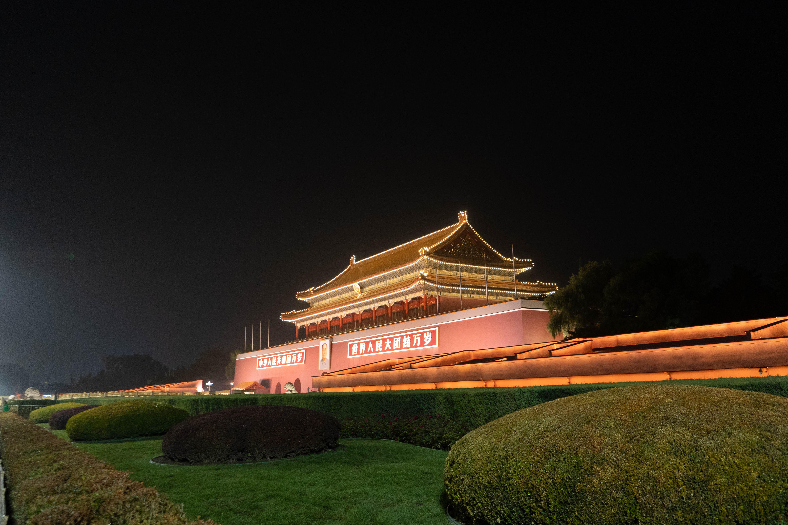

Time: 20211217:other:记录下这一切的开始...:开始：我的第一篇博客
--------

# 背景

离开北京后，能明显感觉到节奏慢了很多很多，也有了一些时间来干自己想干的事情，就比如现在 - 好好弄下我的博客。

之前主要是为了简历好看而建立的，不过现在也不需要通过这些东西来展现自己的能力了，反而可以实现博客真正的功能来 - 用它来记录生活。

# 技术环节

之前的博客是静态部署在**GitHub**上面的，效果很好但是问题也很明显：有时候需要科学上网才能访问。

于是有了现在的计划：自己写个小轮子，并搞个好点的VPS

目前使用 **beego** 框架 ， 照着几个 **GitHub** 的博客抄抄删删， 就有了现在的博客。 不能说完美无缺，只能说勉强能用，以后慢慢改吧 。

# 未来要做的

* 拍摄一组照片，发布出来
* 完成  **浏览量**  ， **标签搜索** , **DNSlog** ，**相邻文章**, **RSS**等功能
* 要健身，目标瘦20斤

最后附上一张离京时拍摄的照片，也希望疫情能早日过去吧 ：

