Time: 20200913:other:大学打取证比赛学的技能，属于炒冷饭了。这里就是记录下...:winhex之从数据恢复到删盘跑路
--------

# 背景

首发于公众号**酒仙桥六号部队**： https://mp.weixin.qq.com/s/Fw9zbUMt0qp5JMEpyfzxRg

# 什么是WINHEX

WINHEX 是一款用于查看和编辑底层十六进制数据的软件，我们可以利用这个软件修改文件格式数据，从而达到数据恢复的效果。
当然，WINHEX也不仅仅用于数据恢复，也可以用于磁盘恢复，RAID重组，镜像转换，CTF 隐写杂项等等。WINHEX 支持中文，在设置栏中进行修改.

* 下载网址： https://www.x-ways.net/winhex/index-m.html

WINHEX 基本界面如下，我们数据恢复用到的功能很少因此只介绍一部分。

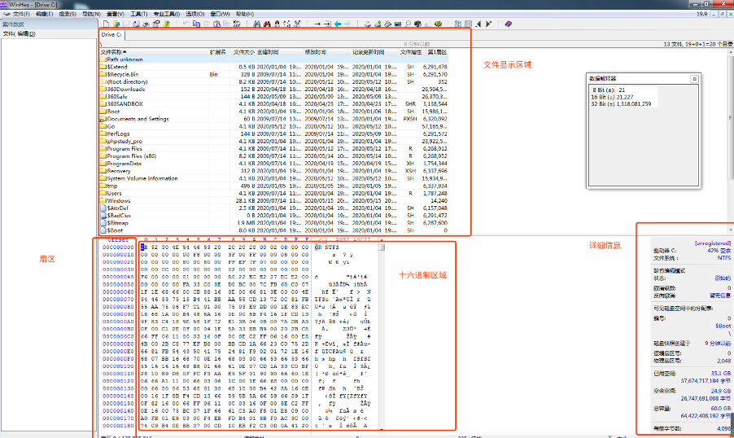

在安装和了解WINHEX的基本结构后，我们就可以愉快的进行数（删）据（盘）恢（跑）复（路）了。

# winhex自动数据恢复

如同字面意思一样，自动恢复就是利用HINHEX 自动在存储数据的扇区中搜索文件类型（根据文件头进行判断），并自动进行查找数据进行恢复。自动回复不需要我们掌握技术原理，操作方式如下：

首先打开你错删文件存储的磁盘，我这里删除的是C盘的文件，因此需要打开的C盘：

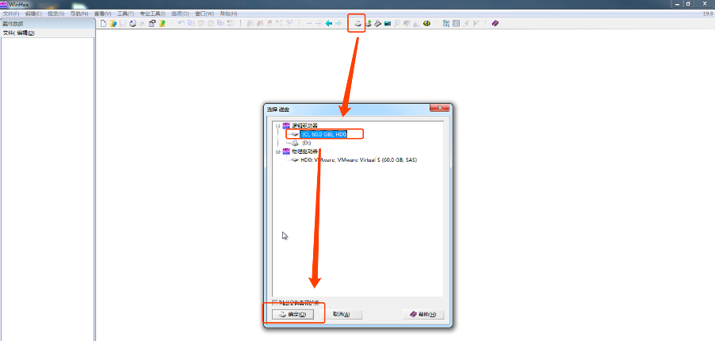

然后选择工具 -> 磁盘工具 -> 按文件类型进行恢复
这里要注意恢复的文件最好是在一个新的磁盘中，以免造成文件覆盖。

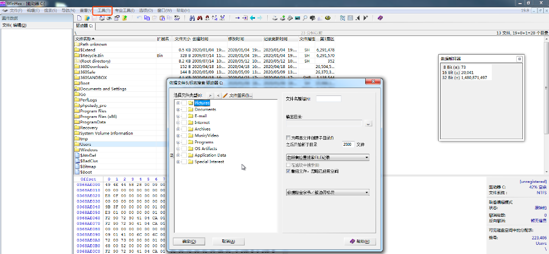

选中我们要恢复的数据类型（可以多选），选中输出目录，点击确定：

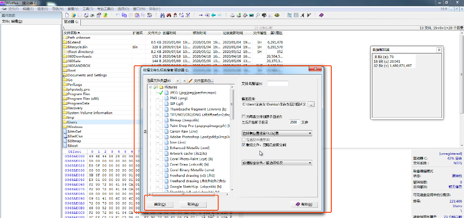

恢复速度和磁盘大小有关，耐心等待数据恢复就好：

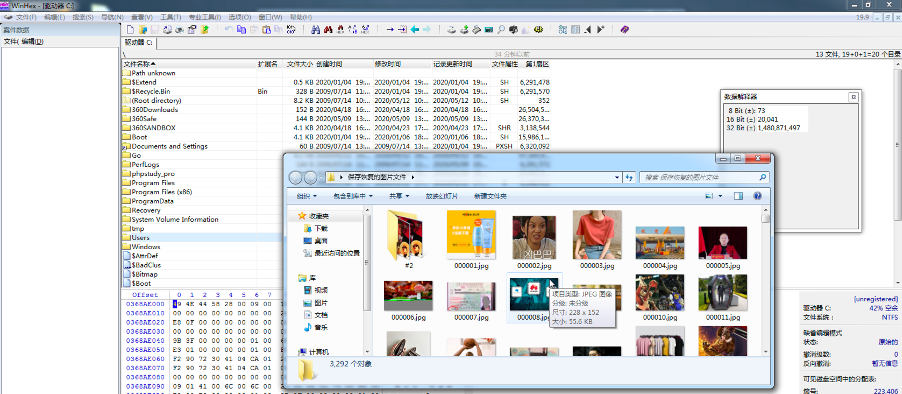

虽然恢复出来了，但是问题还是有很多的： 按照文件类型恢复的数据量多而复杂（因为是无差别寻找），在其中查找我们想要的数据也要花费不少时间；按照文件类型恢复的数据名会丢失（因为在文件系统中，数据内容和数据名不是存放在一个地方）。
因此，如果我们想完整的恢复特定的文件，还是需要进行手动操作恢复的。而在进行手动恢复之前，我们需要了解以下基础知识。

## 什么是文件系统

就像电脑对应的操作系统一样，我们日常使用的移动介质中，也存在相应的文件系统，每种文件系统有自己的存储方式（大同小异），而比较常见的文件系统如下：

1. FAT32/64 常见于U盘，内存卡等文件系统
2. NTFS WIN的文件系统
3. APFS MAC的文件系统
由于文章篇幅原因，这里我们只讲解最常见的HTFS文件系统，也就是使用WINHEX基于WINDOWS的数据恢复。既然我们知道数据是存储在NTFS系统中，那么我们就要了解下NTFS文件系统的存储规则。

## NTFS 文件存储规则

在使用WINHEX查看NTFS文件系统的时候，我们能看见一些以$开头的文件，这些文件就是NTFS操作系统的元文件，元文件用于管理存储介质中的内容：

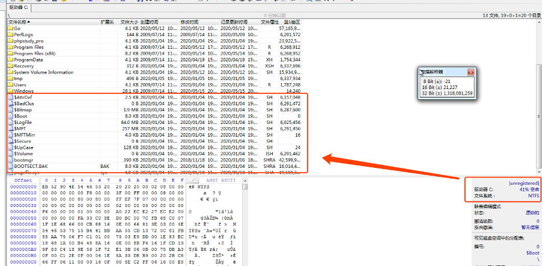

其中每个元文件的功能如下：

1. $MFT 又叫主文件表，用于存储数据名和文件区间的索引（简单理解就是这里存放着文件名信息在内的文件属性信息，是我们数据恢复重点关注的对象）。
2. MFTMIRR就是 MFT的备份文件（但是只备份一部分）
3. $BOOT 引导文件，记录了用于引导的数据
4. DBR备份文件，其中DBR 源文件在0号扇区

## $MFT 元文件结构

上文我们知道文件属性存储在MFT，那么接下来我们需要了解部分数据属性具体在MFT 中的存储状况：在WINHEX中表现如下：

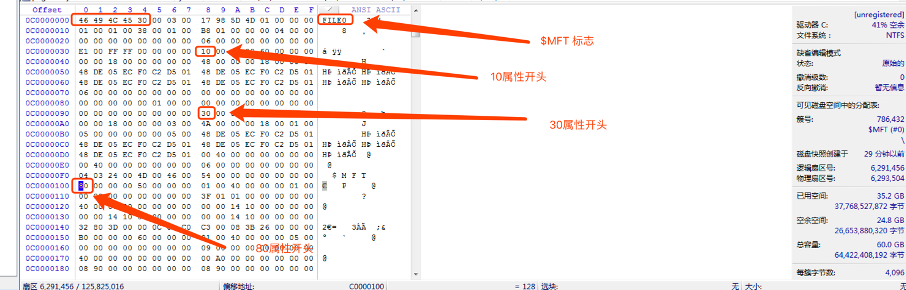

其中文件名是存储在30属性中的，而文件内容是存储在80属性中，然而80属性的容量一般无法存储文件所有的数据，因此，这里涉及到了一个“簇流运行”的概念。

## 什么是簇流运行

“簇流”是指存放数据的一块区域，而“簇流运行”就是指记录“簇流”文件具体在那个位置的数据（这里涉及了80属性的一个“常驻属性”和“非常驻属性”的概念）。
简单说，“簇流运行”就是指文件存储位置的一段字节。而“簇流运行”中存储数据有自己的一套规则。举个例子，某“簇流运行”结构如下：

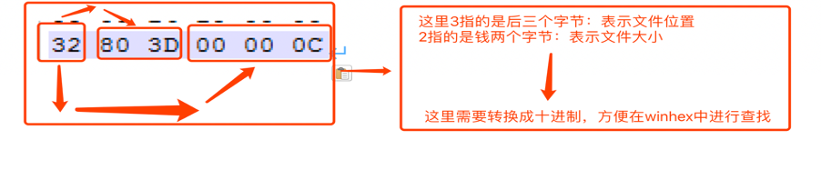

## 删除文件后NTFS的变化

在我们彻底删除一个文件后，在NTFS中到底是有什么变化呢？

在彻底删除一个文件后，只是在$MFT 中的10属性发生变化了，表示这个文件可以被写入数据（这也是为什么我们不建议对要数据恢复的磁盘进行写入操作的原因，害怕会覆盖掉我们要进行数据恢复的文件）。但是数据和数据属性仍然存在。也就是数据恢复的基础。

了解NTFS文件的存储规律后，接下来数据恢复的思路就很明显了：我们使用WINHEX定位到MFT或者MFTMIRR文件，再从MFT/MFTMIRR文件中找到要恢复的文件属性和数据存储扇区，导出扇区中的数据进行数据恢复了。

可能听起来有点懵逼，所以我们接下来手动尝试一遍。

# 使用winhex手工数据恢复

首先，shift+delect彻底删除一张图片作为数据恢复的对象:

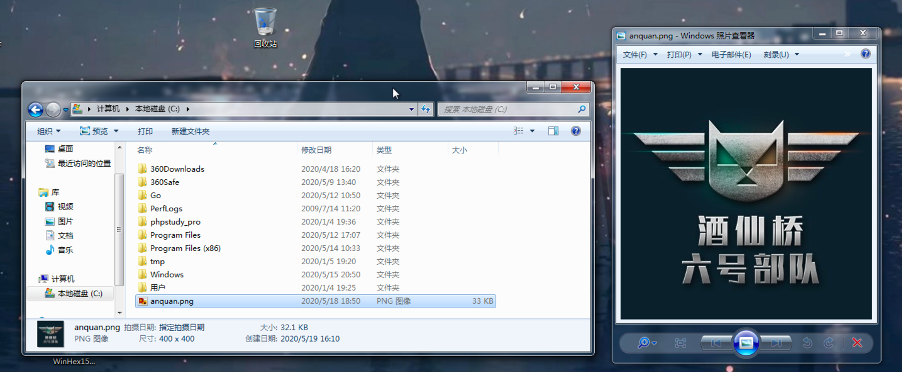

使用winhex 打开被删除文件的磁盘，定位到$MFT 项目，使用winhex搜索文件名：WechatIMG648.jpeg 转换为十六进制：

点击任务栏中的查找十六进制数值，搜索十六进制的文件名，选择向下搜索，点击确定。

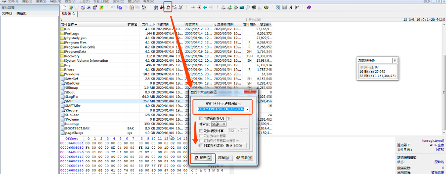

找到文件80属性，找到簇流运行的文件

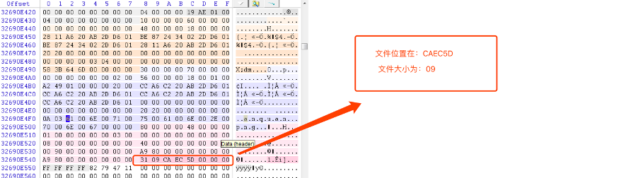

5DECCA（这里读取扇区是需要倒着顺序的）转换成十进制为6155466，使用winhex跳转

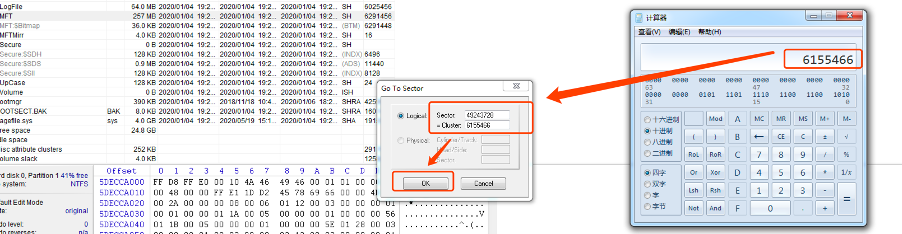

这里我们看到JFIF文件头就能判断是文件开头了，而文件大小是09，转换成十进制也是09，这里我们首先右键，选择标记为文件起始块：

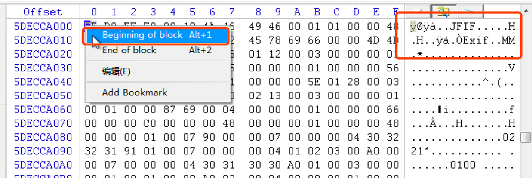

跳转到文件结尾（6155466+9），扇区，右键选择结尾。右键选择编辑，置入新文件,保存。

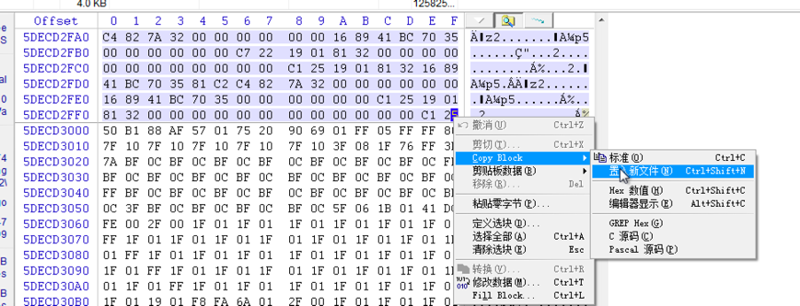

接下来就能看见我们数据恢复出来的文件了～

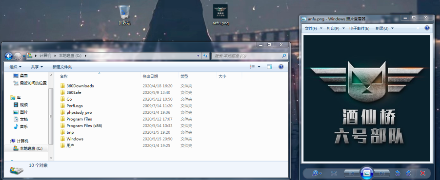

